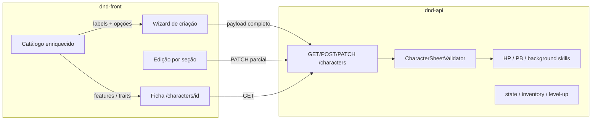

# Plano — Ficha de personagem completa

Roadmap do **dnd-front** para sair do MVP de identidade e chegar a uma ficha jogável, consumindo tudo que a **dnd-api** já expõe (e evoluindo a API onde faltar).

**Estado atual (jul/2026):** criar e listar fichas com nome, nível, classe, espécie, antecedente e subclasse; visualização parcial read-only. Sem edição, sem escolhas de sheet na criação, sem magias/equipamento/features.

**Princípio:** o front **coleta escolhas** e **exibe** dados; a API **valida e computa** (PV, PB, perícias de antecedente, disponibilidade de magias). Zero regras PHB hardcoded no front.

Ver também: [ARCHITECTURE.md](./ARCHITECTURE.md) · [API-INTEGRATION.md](./API-INTEGRATION.md)

---

## Estado atual vs alvo

| Camada                | Hoje                                                 | Alvo                                                                                |
| --------------------- | ---------------------------------------------------- | ----------------------------------------------------------------------------------- |
| **Criar**             | Nome, nível, classe, espécie, antecedente, subclasse | + atributos, perícias, escolhas de espécie/subclasse, equipamento, magias, talentos |
| **Ver**               | PB, PV, atributos, slugs crus                        | Nomes PT, bônus de perícia, traits, features de subclasse, magias, equipamento      |
| **Editar**            | —                                                    | `PATCH /characters/:id` por seção                                                   |
| **Catálogo na ficha** | classes, espécies, antecedentes (só dropdown)        | skills, feats, traits, mechanics, equipment packages, alignments, languages         |
| **Mesa**              | —                                                    | state, inventário, level-up, rest, cast                                             |

---

## Visão geral



### Três camadas de dados na ficha

1. **Dados do jogador** — persistidos pela API: `abilityScores`, `classSkillSlugs`, `speciesChoices`, `subclassOptions`, `characterSpells`, `equipment`, `featSlugs`, `languageSlugs`, …
2. **Dados de catálogo** — nomes, descrições, pools de escolha: `GET /classes/:slug/skills`, `/species/:slug/trait-choices`, `/subclasses/:slug/mechanics`, …
3. **Apresentação** — resolve slugs → PT, calcula bônus de perícia (`mod + PB` se proficiente), agrupa features por nível

---

## O que a API já oferece

### CRUD de ficha (`Bearer` JWT)

| Método | Rota              | Uso no front                            |
| ------ | ----------------- | --------------------------------------- |
| GET    | `/characters`     | Lista                                   |
| GET    | `/characters/:id` | Ficha completa (`CharacterResponseDto`) |
| POST   | `/characters`     | Criação                                 |
| PATCH  | `/characters/:id` | Edição parcial                          |
| DELETE | `/characters/:id` | Excluir                                 |

### Shape da resposta (`CharacterResponseDto`)

| Campo                                          | Origem                    | Editável via PATCH     |
| ---------------------------------------------- | ------------------------- | ---------------------- |
| `id`, `createdAt`, `updatedAt`                 | metadados                 | não                    |
| `name`, `level`, slugs de identidade           | `player_character`        | sim                    |
| `abilityScores`, `abilityGenerationMethodSlug` | core                      | sim (API recalcula PV) |
| `hitPointsMax`, `hitPointsCurrent`             | core / derivado           | sim (override manual)  |
| `proficiencyBonus`                             | derivado de nível         | não (readonly)         |
| `classSkillSlugs`                              | sheet                     | sim                    |
| `backgroundSkillSlugs`                         | derivado do antecedente   | não (readonly)         |
| `speciesChoices`                               | sheet                     | sim                    |
| `subclassOptions`                              | sheet                     | sim                    |
| `featSlugs`                                    | sheet                     | sim                    |
| `characterSpells`                              | sheet                     | sim                    |
| `equipment`                                    | sheet (escolhas iniciais) | sim                    |
| `languageSlugs`                                | sheet                     | sim                    |

### Endpoints de game além do CRUD

| Método    | Rota                                               | Fase |
| --------- | -------------------------------------------------- | ---- |
| POST      | `/characters/roll-abilities`                       | 1    |
| GET/POST  | `/characters/:id/level-up/preview`, `.../level-up` | 4    |
| GET/PATCH | `/characters/:id/state`                            | 4    |
| POST      | `/characters/:id/spells/cast`, `.../rest`          | 4    |
| CRUD      | `/characters/:id/inventory`                        | 4    |

### Catálogo necessário (sem auth)

Já no front: `/classes`, `/species`, `/backgrounds`, `/spells`.

A implementar para a ficha:

| Endpoint                                             | Uso                            |
| ---------------------------------------------------- | ------------------------------ |
| `GET /classes/:slug/skills`                          | Pool de perícias de classe     |
| `GET /classes/:slug/equipment`                       | Pacotes de equipamento inicial |
| `GET /classes/:slug/spells`, `/spell-slots`          | Magias e slots por classe      |
| `GET /subclasses/:slug/mechanics`                    | Features e opções de subclasse |
| `GET /subclasses/:slug/spells`                       | Magias de subclasse            |
| `GET /species/:slug/traits`, `/trait-choices`        | Traços e escolhas de espécie   |
| `GET /backgrounds/:slug/equipment`                   | Equipamento de antecedente     |
| `GET /skills`, `/feats`, `/alignments`, `/languages` | Labels e seleção               |
| `GET /ability-generation-methods`                    | Método de geração de atributos |

Referência completa: `.cursor/skills/dnd-api-contract/references/api-endpoints.md`

---

## Arquitetura FSD proposta

```text
entities/
  character/              # tipos espelhando CharacterResponseDto + UpdatePayload
  skill/                  # SkillSummary (GET /skills)
  feat/                   # FeatSummary
  alignment/              # AlignmentSummary
  language/               # LanguageSummary

features/
  character-sheet/        # visualização + edição da ficha (nova feature)
    api/                  # patchCharacter, deleteCharacter, rollAbilities
    model/                # schemas por seção, merge de PATCH
    ui/                   # seções: identity, abilities, skills, species, subclass, spells, equipment
    lib/                  # skillBonus(), helpers de apresentação

  create-character/       # evolui para wizard multi-step
    steps/                # um componente por etapa

  class-catalog/          # + fetchClassSkills, fetchClassEquipment, fetchClassSpells
  species-catalog/        # + fetchTraitChoices
  background-catalog/     # + fetchBackgroundEquipment

  character-session/      # fase 4: state, rest, cast
  character-level-up/     # fase 4: preview + apply

widgets/
  character-sheet-layout/ # shell com abas ou sidebar de seções
```

### Regra de imports (inalterada)

`features/character-sheet` importa de `entities/character`, `features/*-catalog` e `shared/`. Catálogo do compêndio e ficha **compartilham** os mesmos clients/hooks.

---

## Fases de implementação

### Fase 0 — Fundação

**Objetivo:** tipos, clientes HTTP e utilitários compartilhados. Pré-requisito de tudo.

| Entrega                    | Detalhe                                                                                                              |
| -------------------------- | -------------------------------------------------------------------------------------------------------------------- |
| `CharacterDetail` completo | Incluir `speciesChoices`, `subclassOptions`, `characterSpells`, `equipment`                                          |
| `UpdateCharacterPayload`   | `Partial<CreateCharacterPayload & SheetInput>`                                                                       |
| `characters.api.ts`        | `patchCharacter`, `deleteCharacter`                                                                                  |
| `character-build.api.ts`   | `POST /characters/roll-abilities`                                                                                    |
| Catálogos auxiliares       | clients para `/skills`, `/feats`, `/alignments`, `/languages`, `/ability-generation-methods`                         |
| Catálogos aninhados        | skills/equipment/spells da classe; trait-choices da espécie; mechanics/spells da subclasse; equipment do antecedente |
| `entities/character/lib/`  | `skillBonus(score, proficient, pb)`, helpers de subclasse por nível                                                  |
| Hook `useCatalogLabels`    | Dado slugs da ficha, busca nomes PT do catálogo (TanStack Query, cache 1h)                                           |

**Critério de pronto:** `pnpm build` ok; tipos 1:1 com `CharacterResponseDto`; nenhuma regra PHB hardcoded.

**Arquivos principais:**

- `src/entities/character/types.ts`
- `src/features/characters/api/characters.api.ts`
- `src/features/character-sheet/api/` (novo)
- `src/features/class-catalog/api/` (expandir)
- `src/features/species-catalog/api/` (expandir)
- `src/features/background-catalog/api/` (expandir)

---

### Fase 1 — Wizard de criação completo

**Objetivo:** `POST /characters` com payload validado pela API.

```mermaid
flowchart TD
  A[1. Identidade] --> B[2. Atributos]
  B --> C[3. Classe e perícias]
  C --> D{nível >= 3?}
  D -->|sim| E[4. Subclasse + opções]
  D -->|não| F[5. Espécie + trait choices]
  E --> F
  F --> G[6. Antecedente + equipamento]
  G --> H{conjurador?}
  H -->|sim| I[7. Magias iniciais]
  H -->|não| J[8. Revisão]
  I --> J
  J -->|POST| K[/characters/id]
```

| Etapa       | Campos API                                                                      | Catálogo                                  |
| ----------- | ------------------------------------------------------------------------------- | ----------------------------------------- |
| Identidade  | `name`, `level`, `classSlug`, `speciesSlug`, `backgroundSlug`, `alignmentSlug?` | classes, species, backgrounds, alignments |
| Atributos   | `abilityScores`, `abilityGenerationMethodSlug`                                  | `POST /characters/roll-abilities`         |
| Classe      | `subclassSlug?`, `classSkillSlugs`                                              | `/classes/:slug/skills`                   |
| Subclasse   | `subclassOptions[]`                                                             | `/subclasses/:slug/mechanics`             |
| Espécie     | `speciesChoices[]`                                                              | `/species/:slug/trait-choices`            |
| Antecedente | `equipment[]`                                                                   | class + background equipment              |
| Magias      | `characterSpells[]`                                                             | class + subclass spells                   |
| Revisão     | —                                                                               | preview read-only                         |

**Comportamentos:**

- Pré-selecionar quando só há uma opção
- Limpar escolhas dependentes ao trocar classe/espécie/subclasse
- Subclasse obrigatória a partir do nível 3
- Após criar → redirecionar para `/characters/[id]`

**Critério de pronto:** criar Guerreiro nível 5 Champion com perícias, opções de subclasse e equipamento; API retorna ficha populada.

**Arquivos principais:**

- `src/features/create-character/` (refatorar para multi-step)
- `src/app/characters/new/page.tsx`

---

### Fase 2 — Ficha de leitura estruturada

**Objetivo:** `/characters/[id]` como ficha jogável, não lista de slugs.

| Seção             | Fonte                          | Conteúdo                                             |
| ----------------- | ------------------------------ | ---------------------------------------------------- |
| Cabeçalho         | character + catálogo           | Nome, nível, identidade em PT, alinhamento           |
| Combate           | character                      | PV, PB                                               |
| Atributos         | character                      | 6 scores + modificadores                             |
| Perícias          | character + `/skills`          | Bônus calculado; proficientes (classe + antecedente) |
| Traços de espécie | `speciesChoices` + traits      | Nome e descrição                                     |
| Subclasse         | `subclassOptions` + mechanics  | Features por nível + opções escolhidas               |
| Magias            | `characterSpells` + `/spells`  | known / prepared / always_prepared                   |
| Equipamento       | `equipment` + catálogo         | Pacotes iniciais                                     |
| Talentos          | `featSlugs` + `/feats`         | Nome e descrição                                     |
| Idiomas           | `languageSlugs` + `/languages` | Lista resolvida                                      |

**Critério de pronto:** jogador abre a ficha e entende o personagem sem conhecer slugs.

**Arquivos principais:**

- `src/features/character-sheet/ui/` (novo)
- `src/widgets/character-sheet-layout/` (novo)
- `src/features/characters/ui/character-detail-view.tsx` (substituir ou delegar)

---

### Fase 3 — Edição da ficha

**Objetivo:** alterar qualquer seção via `PATCH`.

| Padrão           | Implementação                                                        |
| ---------------- | -------------------------------------------------------------------- |
| Edição por seção | Botão "Editar" por aba → form → `PATCH` só com campos da seção       |
| Cache            | `invalidateQueries(characterKeys.detail(id))` após mutation          |
| Dependências     | Avisar ao trocar classe/espécie/subclasse (API limpa escolhas órfãs) |
| Excluir          | `DELETE /characters/:id` + confirmação                               |
| Erros            | `ApiError` mapeado para campos do form                               |

**Seções editáveis (suportadas pela API hoje):**

- Identidade, atributos, perícias de classe
- Escolhas de espécie e subclasse
- Magias, equipamento inicial, talentos, idiomas

**Critério de pronto:** editar perícias e opções de subclasse; PV/PB atualizam após mudança de nível/atributos.

---

### Fase 4 — Mesa de jogo

Endpoints já na API, sem front ainda.

| Feature           | Endpoints                          | UI                                         |
| ----------------- | ---------------------------------- | ------------------------------------------ |
| Estado de combate | `GET/PATCH /characters/:id/state`  | PV atual, temp HP, concentração, condições |
| Slots de magia    | state + spell-slots                | Usados / restantes                         |
| Descanso          | `POST /characters/:id/rest`        | Curto / longo                              |
| Conjurar          | `POST /characters/:id/spells/cast` | Gastar slot                                |
| Inventário        | CRUD `/characters/:id/inventory`   | Mochila (≠ equipamento inicial)            |
| Level-up          | preview + POST level-up            | Fluxo guiado                               |

**Nota:** `equipment` na ficha = escolhas de criação. `inventory` = itens em jogo. A UI deve separar os dois.

---

## Lacunas da API (tratar em paralelo)

| Lacuna                                | Impacto                                | Sugestão                                                     |
| ------------------------------------- | -------------------------------------- | ------------------------------------------------------------ |
| Modificadores não na resposta         | Front recalcula (ok)                   | `abilityModifiers` opcional no DTO                           |
| Sem `GET /backgrounds/:slug/skills`   | Só via `backgroundSkillSlugs` na ficha | Novo endpoint de catálogo                                    |
| Validação só se campo enviado         | Create pode ficar incompleto           | Exigir `classSkillSlugs` / `speciesChoices` quando aplicável |
| Sem CA / passive perception           | Combate incompleto                     | Derived stats na API                                         |
| Features de classe (não só subclasse) | Seção features parcial                 | `GET /classes/:slug/features`                                |
| Escolha de atributos do antecedente   | PHB 2024 +2/+1                         | Campo na ficha                                               |

Fases 0–3 funcionam com a API **como está**. Fase 4 e combate completo dependem de evolução no back.

---

## Ordem de execução

```text
Sprint 1   Fase 0 — fundação (tipos, APIs, catálogos aninhados)
Sprint 2   Fase 1 — etapas 1–4 (identidade → atributos → classe → subclasse)
Sprint 3   Fase 1 — etapas 5–8 + Fase 2 (espécie → equipamento → magias → ficha leitura)
Sprint 4   Fase 3 — edição + delete
Sprint 5+  Fase 4 — mesa + gaps API
```

---

## Definição de pronto (MVP de ficha real)

1. **Criar** personagem nível 1 ou 5+ com todas as escolhas obrigatórias PHB
2. **Ver** ficha com nomes PT, perícias com bônus, traits, opções de subclasse e magias
3. **Editar** qualquer seção via PATCH com validação da API
4. **Zero** regras D&D no front
5. Compêndio e ficha compartilham clients/hooks de catálogo

---

## Verificação pós-implementação

```bash
pnpm test:run
pnpm build
pnpm lint
```

Checklist manual:

- [ ] Criar ficha nível 1 com perícias e trait choices
- [ ] Criar ficha nível 5+ com subclasse e `subclassOptions`
- [ ] Ficha exibe nomes PT (não slugs crus)
- [ ] PATCH de perícias persiste e invalida cache
- [ ] DELETE remove ficha e redireciona para lista
- [ ] Erro 401 redireciona para login com `next=`

---

## Referências no repositório

| Assunto             | Caminho                                                                 |
| ------------------- | ----------------------------------------------------------------------- |
| Response DTO        | `dnd-api/src/game/sheet/dto/character-response.dto.ts`                  |
| Create / Update DTO | `dnd-api/src/game/sheet/dto/create-character.dto.ts`                    |
| Validação           | `dnd-api/src/game/sheet/domain/character-sheet.validator.ts`            |
| HP / PB             | `dnd-api/src/game/sheet/domain/character-domain.service.ts`             |
| Front tipos atuais  | `dnd-front/src/entities/character/types.ts`                             |
| Front create        | `dnd-front/src/features/create-character/`                              |
| Front detail        | `dnd-front/src/features/characters/ui/character-detail-view.tsx`        |
| Contrato API        | `dnd-front/.cursor/skills/dnd-api-contract/references/api-endpoints.md` |
